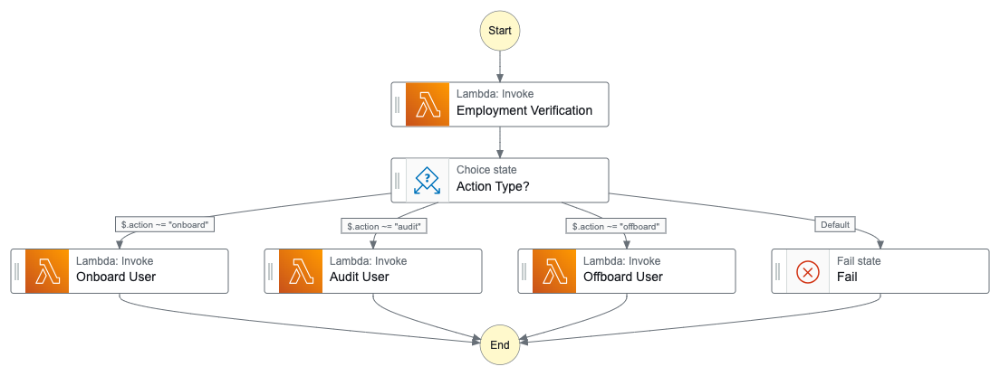

# RBAC Automation
_Automated Role-Based Access Control (RBAC) for employee onboarding, auditing, and offboarding._

## Overview
This AWS Step Functions state machine automates the **onboarding, auditing, and offboarding** of employees through AWS Lambda functions. The workflow ensures that employee access management is seamless and efficient.

## Diagram


## Workflow
1. **Employment Verification** (Lambda function is triggered to verify employment status).
2. **Decision Making** - A choice state determines the next step based on `$.action`:
   - If `$.action == "onboard"` → Invoke **Onboard User** Lambda function.
   - If `$.action == "audit"` → Invoke **Audit User** Lambda function.
   - If `$.action == "offboard"` → Invoke **Offboard User** Lambda function.
   - If no valid action is provided → Move to **Fail state**.
3. **Successful Completion** → The process ends after completing the required action.

## AWS Services Used
- **AWS Step Functions** → Manages the workflow and decision-making process.
- **AWS Lambda** → Executes the logic for employment verification, onboarding, auditing, and offboarding.
- **Amazon CloudWatch** → Monitors logs and performance of the Lambda functions.

## Setup & Deployment
### 1️. Prerequisites
- AWS account with necessary IAM permissions.
- AWS CLI installed and configured.
- Node.js or Python installed for Lambda development.

### 2️. Clone the Repository
```sh
git clone https://github.com/<your-org>/<your-repo>
cd <your-repo>
```

### 3️. Deploy AWS Step Functions & Lambda
#### Install dependencies:
```sh
npm install
```

#### Deploy using AWS SAM or CDK:
```sh
sam build && sam deploy --guided
```
OR
```sh
cdk deploy
```

### 4️. Invoke the State Machine
Manually start the Step Functions execution with:
```sh
aws stepfunctions start-execution \
    --state-machine-arn arn:aws:states:<region>:<account-id>:stateMachine:<state-machine-name> \
    --input '{"action": "onboard"}'
```

Replace `onboard` with `audit` or `offboard` based on the required operation.

## 🚀 Execution States
| State | Service | Description |
|-------|---------|-------------|
| **Start** | AWS Step Functions | Initiates the workflow |
| **Employment Verification** | AWS Lambda | Validates employee credentials |
| **Choice State** | AWS Step Functions | Determines the appropriate action |
| **Onboard User** | AWS Lambda | Handles user onboarding process |
| **Audit User** | AWS Lambda | Performs user access audit |
| **Offboard User** | AWS Lambda | Revokes user access and offboards them |
| **Fail State** | AWS Step Functions | Handles invalid input scenarios |

## 📖 Resources
- [AWS Step Functions Documentation](https://docs.aws.amazon.com/step-functions/latest/dg/welcome.html)
- [AWS Lambda Documentation](https://docs.aws.amazon.com/lambda/latest/dg/welcome.html)
- [AWS CLI Step Functions Commands](https://docs.aws.amazon.com/cli/latest/reference/stepfunctions/index.html)
